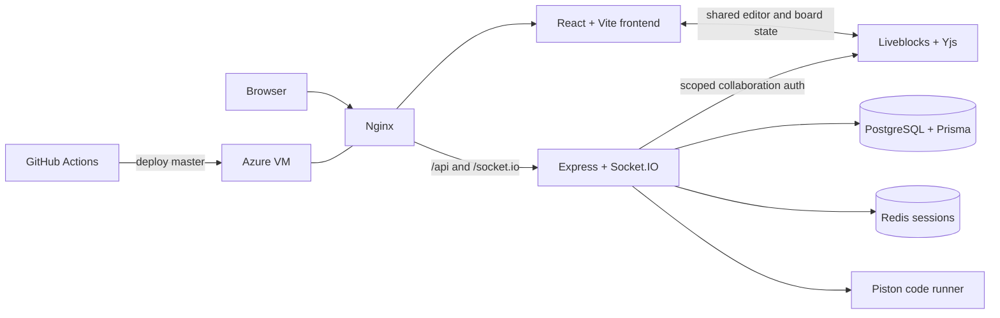

# StarSync

> One shared room to talk, code, sketch, and compete.

StarSync is a collaborative coding workspace for teams, study groups, and friends. Chat with your team, edit the same code, draw out an idea, run programs, or start a timed challenge without stitching together four different apps.

**[Open the live app](https://starsynclive.me)** · **[View the repository](https://github.com/ANUKOOL324/StarSync)**

## Why StarSync

Coding together is usually more fragmented than it needs to be. The conversation lives in Discord or WhatsApp, the code lives in an online editor, the rough idea sits on a whiteboard, and the problems come from a separate judge.

StarSync keeps that session in one place. A room can move naturally from discussion to code to a quick sketch, while everyone can see who is present and what is happening. When the group wants a challenge, the same product becomes a timed programming room with shared problems and live submission activity.

## What you can do

### Build a room around the team

Create a collaborative or competing room and invite people with a join code. Room admins can manage membership, while participants can move between chat and the tools available to that room.

### Talk where the work happens

Messages, typing indicators, presence, and unread counts update in real time. You can also open a direct conversation with a teammate without losing the context of the rooms you share.

### Edit and run code together

The shared Monaco editor keeps code, language, collaborator presence, and cursors in sync. Teams can save their work and run C, C++, JavaScript, TypeScript, or Python with standard input and captured output.

### Sketch the idea, not just explain it

Each collaborative room includes a shared tldraw canvas. Diagrams and rough notes stay attached to the room, and collaborator cursors make it clear who is working where.

### Turn practice into a live contest

Competing rooms assign problems from the built-in problem bank using difficulty and topic preferences. A shared timer drives the session; participants can run visible test cases, submit against the full judge, and watch submission history update across the room.

## How a session flows

**Collaborative room:** create or join a room → talk with the team → open the shared editor or whiteboard → run the code.

**Competing room:** choose the challenge settings → receive assigned problems → start the timer → solve, run, and submit → follow results live.

## Technical highlights

Realtime work has deliberate boundaries. Socket.IO carries application events such as chat, typing, presence, inbox updates, contest timers, and submissions. Liveblocks handles collaborative room state, while Yjs and `y-monaco` bind shared text to Monaco; the tldraw board stores its shared document through Liveblocks as well.

Authentication uses an HttpOnly cookie backed by a Redis session rather than exposing credentials to browser JavaScript. Before granting access to an editor or whiteboard, the backend checks active room membership and issues a room-scoped Liveblocks token.

Code is never executed by the application process. The Express API sends it to a separate Piston runner, then returns normalized compile and runtime output. PostgreSQL and Prisma persist users, rooms, messages, documents, problem assignments, tests, and submissions.

## Architecture at a glance



## Tech stack

| Area | Technologies |
| --- | --- |
| Frontend | React 19, TypeScript, Vite, Tailwind CSS, Monaco, tldraw |
| Backend | Node.js 22, Express 5, TypeScript |
| Realtime | Socket.IO |
| Collaboration | Liveblocks, Yjs, `y-monaco` |
| Data | PostgreSQL, Prisma |
| Authentication | Redis-backed HttpOnly sessions |
| Code execution | Piston in Docker |
| Infrastructure | Nginx, PM2, Azure VM, GitHub Actions |

## Run locally

You will need Node.js 22, PostgreSQL, Redis, Docker, and a Liveblocks secret key.

Clone the repository and create local environment files:

```bash
git clone https://github.com/ANUKOOL324/StarSync.git
cd StarSync
cp Starsync_backend/.env.example Starsync_backend/.env
cp Starsync_frontend/.env.example Starsync_frontend/.env
```

On PowerShell, use `Copy-Item` in place of `cp`. Fill in the two files using the checked-in [backend environment example](Starsync_backend/.env.example) and [frontend environment example](Starsync_frontend/.env.example).

Start PostgreSQL and Redis, then launch the Piston container from the repository root:

```bash
docker compose -f docker-compose.piston.yml up -d
```

Install the supported runtimes using the [code runner guide](Starsync_backend/CODE_RUNNER.md), then prepare and start the backend:

```bash
cd Starsync_backend
npm ci
npx prisma generate
npx prisma migrate deploy
npx prisma db seed
npm run dev
```

In a second terminal, start the frontend:

```bash
cd Starsync_frontend
npm ci
npm run dev
```

Open `http://localhost:5173`.

## Deployment

StarSync is deployed to an Azure VM behind Nginx, with the Node.js API managed by PM2. Redis and Piston remain private to the server, while GitHub Actions builds both applications and deploys pushes to `master`.

See the [deployment guide](deploy/README.md) for the single-server setup and [CI/CD details](deploy/CI_CD.md) for the production workflow.

## Built to explore

StarSync is a hands-on exploration of realtime systems, collaborative state, code execution, and production delivery—wrapped in a product people can actually use together.
